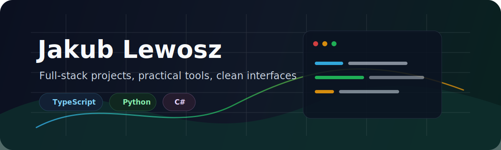

  

  
  
  

## Cześć, jestem Jakub Lewosz

Jestem **młodym programistą** rozwijającym się w kierunku automatyzacji z wykorzystaniem AI, aplikacji webowych i praktycznych narzędzi wspierających codzienną pracę.

Szukam **zdalnego stażu**, pracy dorywczej albo pierwszych zleceń związanych z automatyzacją, AI, aplikacjami webowymi i narzędziami, które pomagają ograniczać powtarzalne zadania.

Obecnie jako główny projekt portfolio rozwijam **ElektroScan** - aplikację webową do analizy planów PDF i automatycznego zliczania symboli elektrycznych.

## W skrócie

- Główny kierunek: automatyzacja z pomocą AI i praktyczne aplikacje webowe.
- Najważniejszy projekt do sprawdzenia: [ElektroScan](https://github.com/JakubLewosz/ElektroScan).
- Interesują mnie narzędzia, które analizują dane, porządkują informacje, wspierają użytkownika i automatyzują fragmenty pracy.
- Dbam o czytelny kod, prostą strukturę projektu i dokumentację, którą da się wykorzystać podczas uruchamiania aplikacji.

## Publiczne repozytoria

Profil jest uporządkowany wokół czterech publicznych repozytoriów, które najlepiej pokazują moje obecne zainteresowania: aplikacje webowe, automatyzację, przetwarzanie dokumentów i praktyczne eksperymenty z AI.

### [ElektroScan](https://github.com/JakubLewosz/ElektroScan)

Główny, aktywnie rozwijany projekt portfolio. Aplikacja webowa wspierająca analizę planów elektrycznych zapisanych jako PDF. Projekt pokazuje pracę z backendem, interfejsem przeglądarkowym, przetwarzaniem dokumentów i automatyzacją powtarzalnego liczenia symboli.

**Technologie:** Python, FastAPI, OpenCV, PyMuPDF, NumPy, Pydantic, Server-Sent Events, React, TypeScript, Vite, Tailwind CSS, Playwright, Docker Compose.

### [CodeFabric](https://github.com/JakubLewosz/CodeFabric)

Zamknięty, współtworzony prototyp aplikacji wykorzystującej generatywną AI do wspierania pracy programistycznej: od opisu pomysłu, przez plan działania, po generowanie i poprawianie plików projektu. Repozytorium zostawiam jako przykład eksperymentu z agentami i automatyzacją pracy programisty.

**Technologie:** Python, Streamlit, LangChain, LangGraph, Ollama, ChromaDB, Pydantic.

### [Samurai's Last Stand](https://github.com/JakubLewosz/samurais-last-stand)

Fork i rozwijany projekt gry 2D w Godot 4. Repozytorium pokazuje moje zainteresowanie GameDevem, GDScriptem, scenami, sterowaniem postacią, przeciwnikami i falami walki.

**Technologie:** Godot 4, GDScript, sceny 2D, eksport Windows.

### [JakubLewosz](https://github.com/JakubLewosz/JakubLewosz)

Repozytorium profilowe GitHuba z publicznym README, banerem i bezpieczną wersją CV w Markdown.

## Technologie

**Automatyzacja i AI:** generatywna AI, analiza wymagań, generowanie struktury projektu, narzędzia wspierające pracę.

**Aplikacje webowe:** React, TypeScript, JavaScript, HTML, CSS, Tailwind CSS, Vite.

**Backend i przetwarzanie danych:** Python, FastAPI, Pydantic, Streamlit, API, PyMuPDF, NumPy, OpenCV.

**Narzędzia:** Git, Docker Compose, Playwright, Godot 4, GDScript, testy backendu, skrypty weryfikacyjne.

**Pozostałe doświadczenie:** C#, projekty grupowe, podstawy GameDev i robotyki.

## Doświadczenie i osiągnięcia

- Projekt ElektroScan jako główny, aktywnie rozwijany projekt portfolio automatyzujący analizę planów PDF.
- Zamknięty projekt CodeFabric związany z generatywną AI i automatyzacją pracy programistycznej.
- Projekt GameDev w Godot 4 rozwijany jako praktyka pracy ze scenami, skryptami i mechanikami gry 2D.
- Certyfikat PCEP – Certified Entry-Level Python Programmer.
- Udział w kole GameDev i kole robotyki.
- Doświadczenie projektowe związane z tworzeniem gry oraz udziałem w konkursach edukacyjnych.
- Lider projektu finałowego realizowanego w programie Zwolnieni z Teorii.

## CV

Publiczna wersja CV bez prywatnych danych jest dostępna tutaj: [cv/README.md](./cv/README.md).

## Kontakt

  

