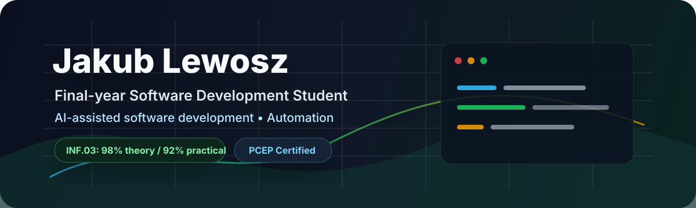

  

  
  
  

  <a href="https://github.com/JakubLewosz/AutoRelay">AutoRelay</a> ·
  <a href="https://github.com/JakubLewosz/ElektroScan">ElektroScan</a> ·
  <a href="https://github.com/JakubLewosz/CodeFabric">CodeFabric</a> ·
  <a href="https://github.com/JakubLewosz/samurais-last-stand">Samurai's Last Stand</a>

## About me

I am a final-year student at Technikum Programistyczne INFOTECH in Białystok, completing a five-year software development education from 2022 to 2027. I use AI-assisted development workflows to plan, build, test, and document software, with an emphasis on automation and practical applications. My experience includes two 150-hour vocational internships as well as solo and team-based projects.

I passed the INF.03 vocational qualification examination with **98% in theory** and **92% in the practical examination**. I am preparing for INF.04 in the winter 2026/27 session.

## Featured projects

### [AutoRelay](https://github.com/JakubLewosz/AutoRelay) — solo full-stack portfolio project

A webhook-driven automation platform that evaluates a safe conditional rule and delivers one retryable HTTP or Discord action. It combines a FastAPI API, PostgreSQL-backed sessions and execution queue, a separate worker, and a responsive React dashboard, with documented authorization, encryption, CSRF, and SSRF protections.

**Python · FastAPI · PostgreSQL · SQLAlchemy · Alembic · React · TypeScript · Docker Compose · GitHub Actions**

### [ElektroScan](https://github.com/JakubLewosz/ElektroScan) — flagship project · active development

A web application that demonstrates computer-vision-assisted analysis of electrical plans in PDF format, including symbol detection and counting.

> The public repository contains an earlier showcase version of ElektroScan. A substantially improved version is currently being developed privately by a two-person team.

Both team members share responsibilities across the backend, frontend, computer vision, testing, and documentation. The public version uses Python, FastAPI, Pydantic, OpenCV, PyMuPDF, NumPy, Server-Sent Events, React, TypeScript, Vite, Tailwind CSS, Playwright, Docker Compose, and GitHub Actions.

### [CodeFabric](https://github.com/JakubLewosz/CodeFabric) — solo project · completed prototype

A prototype for AI-assisted software project generation. A user describes a new application or requested change; CodeFabric prepares a plan for approval or revision, generates or edits project files, and performs an LLM-based review against the approved plan. It uses locally or privately hosted Ollama models through a Streamlit interface and a LangGraph workflow.

I originally developed CodeFabric during my 150-hour internship at the Office of the Polish Financial Supervision Authority (UKNF) and later refined it independently. **CodeFabric was developed as an individual internship project and was not an official product or production system of the Office of the Polish Financial Supervision Authority.**

### [Samurai's Last Stand](https://github.com/JakubLewosz/samurais-last-stand) — three-person team project

A 2D action game created for GameJamPlus Poland 2024/25 with Godot 4 and GDScript, representing 100 hours of documented project work. I shared responsibility for gameplay programming, testing, level development, and iterative improvements in a three-person team.

This repository is a fork of the original team repository and is kept on my profile to document my contribution to the project.

## Vocational experience

### Office of the Polish Financial Supervision Authority (UKNF)

**Vocational Software Development Internship** · Warsaw, Poland · on-site 
3 November 2025 – 3 December 2025 · 150 hours

Developed CodeFabric as a solo internship project and continued refining it independently after the placement. The project was neither commissioned nor deployed as an official UKNF product.

### Technikum Programistyczne INFOTECH

**Vocational Software Development Internship** · Białystok, Poland · hybrid, based at the school 
27 April 2026 – 25 May 2026 · 150 hours

Worked on ElektroScan in a two-person team from an original brief proposed by the school director. Responsibilities were shared across backend and frontend development, computer vision, testing, and documentation.

## Education and qualifications

- **Technikum Programistyczne INFOTECH in Białystok** — software development / technician programmer education, 2022–2027; final-year student.
- **INF.03 vocational qualification examination** — passed with 98% in theory and 92% in the practical examination.
- **INF.04 vocational qualification examination** — currently preparing for the winter 2026/27 session.
- **PCEP – Certified Entry-Level Python Programmer** — certified 20 June 2023; exam PCEP-30-01; code `MQCs.H0Lp.kDCs`; [verification](https://verify.openedg.org).
- **English** — B1–B2, self-assessed.

## Leadership and additional projects

### FinFlow

Led a seven-person team developing a partially functional mobile application prototype designed to teach young people the fundamentals of investing and related financial concepts. Responsibilities included planning, task allocation, partner communication, project presentation, and partial contribution to application development.

FinFlow was a technological social-action project completed through Zwolnieni z Teorii on 9 April 2026. It has no public repository.

## Credentials and activities

- **GameJamPlus Poland 2024/25** — team member behind Samurai's Last Stand; 100 documented project hours.
- **Project Management Principles** — completed with the FinFlow social-action project; 20 PDUs; completed 9 April 2026; certificate `QEAN4NBsj245`; [verification](https://verify.zwolnienizteorii.pl).
- **FinFlow** — project leader; completed 9 April 2026.

Additional learning and activities

- **AI for Social Impact Projects** — completed with a social-action project on 9 April 2026; certificate `q2OLeJLuZjpX`; [verification](https://verify.zwolnienizteorii.pl).
- **AI for Today** — completed 16 February 2026; foundational learning about the ethical and responsible use of AI.
- **SOFTECH workshops** — 6 February 2023 – 23 June 2023; creativity, communication, collaboration, and critical thinking.
- **IV Łomżyńskie Zawody Robotów Mobilnych – Robot Challenge** — participant with team INFOTECH2 on 24 November 2023.

## How I work with AI

I use AI tools throughout the software development process, including requirements analysis, planning, implementation, debugging, testing, and documentation. OpenAI Codex is one of my development tools. I run generated solutions, inspect the resulting code, test their behavior, correct errors, and remain responsible for the final result.

## Technologies used in my projects

- **AI-assisted development and local models:** OpenAI Codex as a development tool, Ollama, LangGraph, LangChain Core, LangChain Ollama.
- **Backend and APIs:** Python, FastAPI, Pydantic, SQLAlchemy, Alembic, PostgreSQL, REST APIs.
- **Computer vision and document processing:** OpenCV, PyMuPDF, NumPy.
- **Frontend:** React, TypeScript, Vite, Tailwind CSS, Streamlit.
- **Quality and delivery:** Git, GitHub Actions, Docker Compose, pytest, Ruff, Playwright.
- **Game development:** Godot 4, GDScript.

## Contact

- Białystok, Poland
- [jakublewosz6@gmail.com](mailto:jakublewosz6@gmail.com)
- [github.com/JakubLewosz](https://github.com/JakubLewosz)
